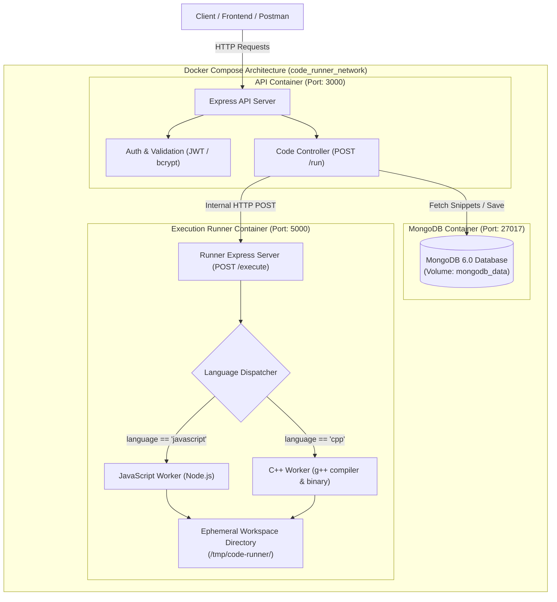

# Containerized Online Code Runner (DevOps Assignment 3)

A secure, modular, and containerized Online Code Runner system built with **Node.js**, **Express**, **C++ (g++)**, **MongoDB**, and **Docker Compose**.

The system decouples API operations from untrusted code execution. The API container never executes user-submitted code directly; all execution tasks are delegated to an isolated Execution Runner service operating within a private Docker bridge network.

---

## 1. Architecture Diagram



---

## 2. Architecture Explanation

The application is structured into three decoupled services orchestrated via Docker Compose:

1. **API Service (`api`)**:
   - Built on Node.js and Express.
   - Handles client authentication (JWT, bcrypt), user registration, code snippet persistence, and request validation.
   - **Critical Security Rule**: The API service **NEVER** compiles or executes submitted code. It forwards execution payloads to the Runner service over Docker's internal DNS network (`http://runner:5000/execute`).
   - Runs as an unprivileged `node` user inside the container for defense-in-depth.

2. **MongoDB Service (`mongodb`)**:
   - Official MongoDB 6 container.
   - Persists user accounts and saved code snippets using a named Docker volume (`mongodb_data`).
   - Accessible only over the internal bridge network; isolated from direct public internet exposure unless explicitly mapped.

3. **Execution Runner Service (`runner`)**:
   - Standalone microservice container based on Alpine Linux with Node.js and GCC (`g++`).
   - Exposes an internal HTTP endpoint `POST /execute`.
   - Isolates code execution to ephemeral, request-scoped directories.
   - Enforces execution timeouts and memory buffer caps.
   - Cleans up all generated files immediately after execution.

---

## 3. Request Flow

When a user submits code to be executed:

1. **Client Request**: The client sends an HTTP `POST /run` to the API service (`http://localhost:3000/run`) with a JSON payload:
   ```json
   {
     "language": "cpp",
     "code": "#include <iostream>\nint main() { std::cout << \"Hello World\"; return 0; }",
     "input": ""
   }
   ```
2. **Validation**: The API validates that `code` is a valid string. If `language` is omitted, it defaults to `"javascript"` for backward compatibility.
3. **Delegation**: The API issues an internal HTTP POST request to `http://runner:5000/execute`.
4. **Directory Allocation**: The runner generates a unique UUID (e.g., `4f9b8c2a-11e4-...`) and creates an isolated temporary directory `/tmp/code-runner/<UUID>/`.
5. **Execution**:
   - For **JavaScript**: Writes `code.js` and `input.txt`. Spawns a sandboxed `node` child process with piped stdin.
   - For **C++**: Writes `main.cpp` and `input.txt`. Compiles `main.cpp` with `g++ -O2`. If compilation succeeds, executes the binary with input piped to stdin.
6. **Capture & Response**: Captures stdout, stderr, execution duration, and exit status.
7. **Cleanup**: A `finally` block recursively deletes `/tmp/code-runner/<UUID>/`.
8. **Client Return**: The API formats the response and returns the execution result to the client.

---

## 4. Concurrent Request Handling

Concurrency is handled safely without shared state or global file collisions:

- **No Global Filenames**: The previous implementation wrote to hardcoded `code.js` and `input.txt` in the root folder, causing race conditions where concurrent requests would overwrite each other's code.
- **UUID-Partitioned Workspaces**: Every incoming request is assigned a distinct UUID via `crypto.randomUUID()`. All source files, inputs, and compiled binaries are written strictly inside that request's dedicated directory:
  ```
  /tmp/code-runner/
  ├── a1b2c3d4-xxxx/   <-- Request A (JavaScript)
  │   ├── code.js
  │   └── input.txt
  └── e5f6g7h8-yyyy/   <-- Request B (C++)
      ├── main.cpp
      ├── main (binary)
      └── input.txt
  ```
- **Independent Child Processes**: Node's asynchronous event loop spawns individual child processes for each request. The standard streams (`stdin`, `stdout`, `stderr`) are piped directly to that request's process instance.
- **No Shared Mutexes**: Requests execute concurrently and asynchronously without blocking the API or other executions.

---

## 5. Execution Isolation

- **Process Isolation**: Untrusted code is executed inside child processes managed within the runner container, isolated from the host machine and the API container.
- **Network Decoupling**: In production Docker Compose, the runner container communicates only across the internal Docker bridge network (`code_runner_network`). It does not accept direct public web traffic.
- **Filesystem Confinement**: Each execution is confined to its temporary UUID directory. Process working directories (`cwd`) are set directly to this isolated folder.
- **Least-Privilege API**: The API container does not contain GCC, G++, or execution permissions for user code. Even if a vulnerability were exploited in the API, no native compilation or code runner tooling is present.

---

## 6. Cleanup Strategy

To prevent disk saturation and stale file accumulation:

- All execution logic is wrapped in a robust `try ... finally` block:
  ```javascript
  try {
    // 1. Create unique directory
    fs.mkdirSync(jobDir, { recursive: true });
    // 2. Compile and run
    result = await runHandler(...);
    res.json(result);
  } finally {
    // 3. Guaranteed cleanup regardless of outcome
    if (fs.existsSync(jobDir)) {
      fs.rmSync(jobDir, { recursive: true, force: true });
    }
  }
  ```
- Whether the execution **succeeds**, **fails compilation**, **throws a runtime exception**, or **times out**, the directory and all contained files (`code.js`, `main.cpp`, compiled executables, and `input.txt`) are unconditionally deleted.

---

## 7. Timeout Strategy

To protect the server from infinite loops (e.g., `while(true) {}`) or denial-of-service attacks:

- **Configurable Timeout**: Default timeout is set to `5000 ms` (5 seconds), configurable via the `TIMEOUT_MS` environment variable.
- **Active Watchdog**: A timer monitors child process execution. If the process does not terminate within the time limit, the runner issues a `SIGKILL` signal to immediately terminate the process tree.
- **Clean Response**: Instead of hanging the connection or crashing the server, the system returns an HTTP `408 Request Timeout` response:
  ```json
  {
    "message": "Execution Timed Out",
    "stdout": "",
    "stderr": "Execution timed out after 5000 ms",
    "executionTime": "5032 ms"
  }
  ```
- **Output Buffering Cap**: Standard output and error streams are capped at 1 MB (`MAX_OUTPUT_BYTES`) to prevent memory exhaustion from programs that print unbounded data inside loops.

---

## 8. Error Handling

The system distinguishes between different error types and returns clear, actionable feedback:

1. **Compilation Errors (C++)**:
   - If `g++` compilation fails (exit code $\neq 0$), compilation stderr diagnostics are captured.
   - The API returns HTTP `400 Bad Request` with `{ message: "Compilation Error", stderr: "<gcc diagnostics>" }`.
   - The binary execution phase is skipped, avoiding unnecessary execution attempts.
2. **Runtime Errors**:
   - If the code executes but exits with an error or unhandled exception, stderr is returned with HTTP `400 Bad Request` and `{ message: "Runtime Error", stderr: "..." }`.
3. **Timeout Errors**:
   - Exceeded time limits return HTTP `408 Request Timeout`.
4. **API Resiliency**:
   - The API wraps external runner communications in a `try/catch`. If the runner service is unreachable, it logs the error via Winston and returns an HTTP `500` with a descriptive error message rather than crashing the Express process.

---

## 9. Docker Compose Explanation

The environment is configured via `docker-compose.yml`:

```yaml
services:
  mongodb:
    image: mongo:6
    volumes:
      - mongodb_data:/data/db
    networks:
      - code_runner_network
    healthcheck:
      test: ["CMD", "mongosh", "--eval", "db.adminCommand('ping')"]

  runner:
    build:
      context: ./runner
      dockerfile: Dockerfile
    environment:
      - PORT=5000
      - TIMEOUT_MS=5000
    networks:
      - code_runner_network
    healthcheck:
      test: ["CMD", "wget", "-qO-", "http://localhost:5000/health"]

  api:
    build:
      context: .
      dockerfile: Dockerfile
    ports:
      - "3000:3000"
    environment:
      - PORT=3000
      - MONGO_URI=mongodb://mongodb:27017/compiler
      - RUNNER_SERVICE_URL=http://runner:5000
    depends_on:
      mongodb:
        condition: service_healthy
      runner:
        condition: service_healthy
    networks:
      - code_runner_network

networks:
  code_runner_network:
    driver: bridge

volumes:
  mongodb_data:
```

### Key Elements:

- **`code_runner_network`**: A private bridge network allowing inter-container communication using service hostnames (`mongodb`, `runner`, `api`).
- **`depends_on` with `condition: service_healthy`**: Guarantees the API container does not start accepting traffic until MongoDB is accepting database connections and the Runner service passes its health check.
- **`mongodb_data` Volume**: Ensures data persistence across container restarts and rebuilds.

---

## 10. Trade-Off Analysis

### Comparison: Container-per-Request vs. Long-Running Execution Container

| Criteria               | Container-per-Request                                                                                                                                                                  | Long-Running Reused Runner Container (Implemented)                                                                                       |
| :--------------------- | :------------------------------------------------------------------------------------------------------------------------------------------------------------------------------------- | :--------------------------------------------------------------------------------------------------------------------------------------- |
| **Startup Latency**    | High overhead (~1.5s - 3.0s per request to spin up a fresh container). Sluggish user experience.                                                                                       | Minimal overhead (< 15ms). The container is pre-warmed and ready to execute immediately.                                                 |
| **Resource Usage**     | Heavy CPU and memory churn due to continuous container creation, daemon interaction, and destruction.                                                                                  | Low and predictable memory footprint. Minimal daemon overhead.                                                                           |
| **Complexity**         | High. Requires Docker socket mounting (`/var/run/docker.sock`), Docker CLI inside containers, and complex volume bind translations (especially error-prone on Windows Docker Desktop). | Straightforward. Uses standard HTTP microservice communication and standard Node child process APIs.                                     |
| **Security Isolation** | Strong kernel-level isolation (cgroups, namespaces per execution). However, exposing the Docker socket to the API introduces severe host breakout security risks.                      | Application-level isolation via UUID directories, timeouts, buffer caps, and network segregation. Enhanced when runner runs as non-root. |
| **Scalability**        | Harder to scale horizontally; limited by host Docker daemon's container creation concurrency limit.                                                                                    | Easily scalable horizontally using Docker Compose (`docker compose up --scale runner=3`) behind a load balancer.                         |

### Architectural Verdict

For an educational online judge / code execution assignment, the **Long-Running Reused Runner Container** with per-request directory and process sandboxing is the superior choice. It offers instantaneous execution feedback (<100ms response times), clean maintainable code, zero brittle Docker-socket dependencies, and native horizontal scaling capabilities.

---

## 11. Quickstart & Usage

### Running with Docker Compose (Recommended)

1. Ensure Docker Desktop is running.
2. Build and start all services:
   ```bash
   docker compose up --build
   ```
3. The API will be available at `http://localhost:3000`.

### Running Locally (Without Docker)

1. Start MongoDB on `127.0.0.1:27017`.
2. Start the Runner Service:
   ```bash
   cd runner
   npm install
   npm start
   ```
3. In a separate terminal, start the API:
   ```bash
   npm install
   npm start
   ```

---

## 12. API Documentation

### Execute Code

**Endpoint:** `POST /run`

#### Request Body (JavaScript):

```json
{
  "language": "javascript",
  "code": "console.log('Hello from JS');",
  "input": ""
}
```

#### Request Body (C++):

```json
{
  "language": "cpp",
  "code": "#include <iostream>\nint main() { std::cout << \"Hello from C++\"; return 0; }",
  "input": ""
}
```

#### Request with Stdin Input:

```json
{
  "language": "javascript",
  "code": "const fs = require('fs'); console.log(fs.readFileSync(0, 'utf8'));",
  "input": "Sample Input"
}
```

#### Successful Response (`200 OK`):

```json
{
  "stdout": "Hello from JS\n",
  "stderr": "",
  "executionTime": "95 ms"
}
```

#### Compilation Error Response (`400 Bad Request`):

```json
{
  "message": "Compilation Error",
  "stdout": "",
  "stderr": "main.cpp:5:5: error: expected ';' before 'return'",
  "executionTime": "320 ms"
}
```

#### Timeout Response (`408 Request Timeout`):

```json
{
  "message": "Execution Timed Out",
  "stdout": "",
  "stderr": "Execution timed out after 5000 ms",
  "executionTime": "5032 ms"
}
```

---

## 13. Automated Test Suite

An automated test script (`test-runner.js`) is provided to verify all 6 required test scenarios:

```bash
node test-runner.js
```

### Verified Test Cases:

1. **JavaScript Hello World** (stdout match)
2. **JavaScript with Stdin Input** (piped input match)
3. **C++ Hello World** (compilation + execution)
4. **Invalid C++ Code** (returns compilation error diagnostics without crashing)
5. **Infinite JavaScript Loop** (`while(true){}` killed cleanly by timeout)
6. **Concurrent Requests** (4 simultaneous requests across JS and C++ execute in isolation with zero interference or mixed outputs)

---

## Author

Mayur Atlani
